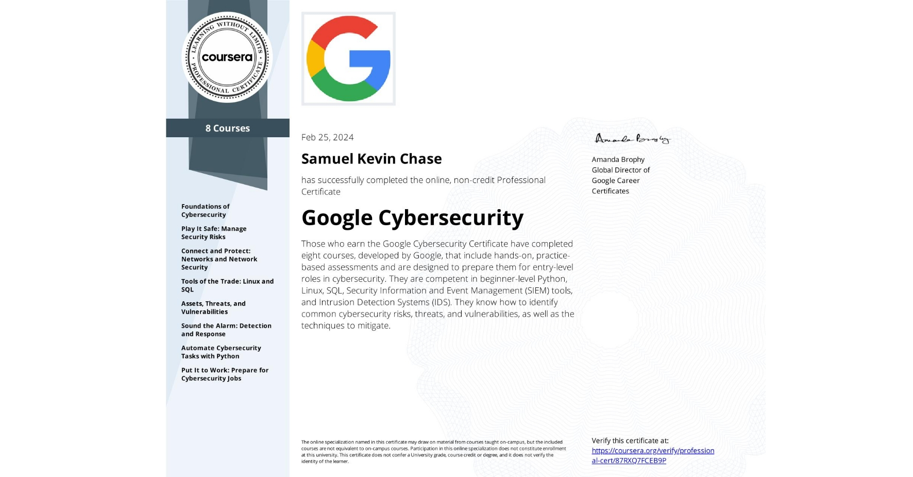

#  About Me:
- Hello, my name is Samuel Chase. I am enthusiastic about embarking on a journey to obtain my Cybersecurity Certificate alongside pursuing my Bachelor’s degree in Computer Science at Utah State University. While I am relatively new to the cybersecurity field, my passion for technology and problem-solving, coupled with my inherent curiosity and determination, has been a driving force behind my decision to delve into this dynamic and crucial area of expertise.
- I bring to the table a strong foundation in critical thinking, attention to detail, and adaptability—traits that I believe are essential for success in cybersecurity. I thrive in environments that require continuous learning and rapid adaptation, qualities that align seamlessly with the ever-evolving nature of cybersecurity. Moreover, my commitment to ethical conduct and integrity underscores my approach to addressing security challenges responsibly and ethically.
- I am deeply motivated by the opportunity to contribute to the security of digital systems and to safeguard the data and privacy of individuals and organizations alike. The prospect of being at the forefront of defending against cyber threats and vulnerabilities excites me, and I am eager to apply my skills and knowledge to make a meaningful impact in this vital field. 
- When I am not coding I am an enthusiast in rock climbing, swimming, and cooking!

## Cybersecurity Skills and Certifications:

### Security Certification:
- **Google Cyber Security Certification**
  - Completed on February 24, 2024

### Technical Skills:
- **Languages:** Python, SQL
- **Linux Command Line:** Proficient in Linux command line usage
- **Security Mindset:** Demonstrated understanding of security principles and best practices
- **Frameworks and Controls:** Familiarity with cybersecurity frameworks and controls
- **SIEM Tools:** Experienced in using Splunk for security information and event management
- **Packet Sniffers:** Proficient with Wire Shark for network traffic analysis

### Cybersecurity Expertise:
- **Threats, Risks, Vulnerabilities:** Knowledgeable about cybersecurity threats, risks, and vulnerabilities
- **Incident Response:** Skilled in incident response procedures and protocols
- **Security Frameworks and Controls:** Understanding of various security frameworks and controls
- **Security Hardening:** Capable of implementing security hardening measures to enhance system security

### Communication Skills:
- **Tech Communication for the CS Workplace:** Proficient in communicating technical concepts and cybersecurity issues effectively in the workplace

## 🌐 Socials:

# 💻 Tech Stack:
 
 
 
 
 

# 📊 GitHub Stats:
 
 

---

# Google Certificate 

